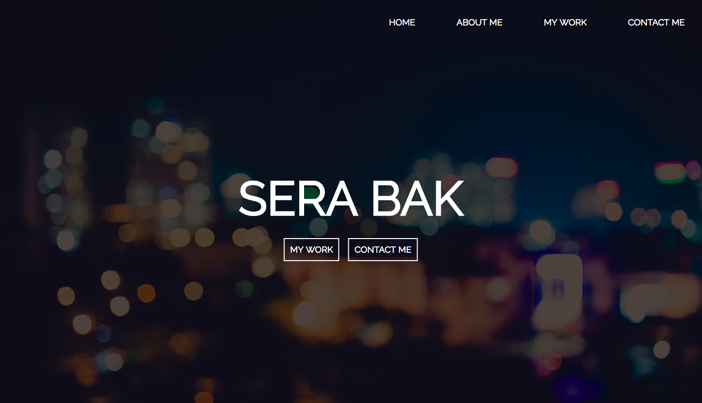

# ${1:Personal Portfolio}

TODO: Write a project description - https://serabakpak.github.io/

## Technologies Used

TODO: Describe the technologies used

# Deliverables

On Friday, we will be having a feedback session on your progress on the personal portfolio project. By then we expect to see:

* An updated README.md file. A readme is like the cover to the book of code you've written for this site. Don't publish a book without a cover! Describe this project in a few sentences - what are you trying to achieve with this page, what technologies are you using, etc. [This is a decent template](https://gist.github.com/zenorocha/4526327) for the way that a readme often looks. Make sure to link to the live site and include some sort of image (logo or screenshot). If you need help writing markdown language (the reason the file ends in `.md`), check out [this guide](https://github.com/adam-p/markdown-here/wiki/Markdown-Cheatsheet).

* Some custom HTML, CSS, JS, and images. Put your own personal flare on the page and add some customizations. These could be really simple changes that add a bit of your aesthetic or they could be larger features like a navbar, a footer, a photo carousel, bootstrap integration, event listeners, or CSS animations. [Google for personal websites](https://www.google.com/search?q=personal+website&espv=2&biw=1280&bih=612&site=webhp&tbm=isch&tbo=u&source=univ&sa=X&ved=0ahUKEwjx-Krl6bfOAhUUI2MKHaoPDUEQsAQIQA&dpr=2#imgrc=OOkEvdqZczSU-M%3A), find one that you like, and imitate it!

